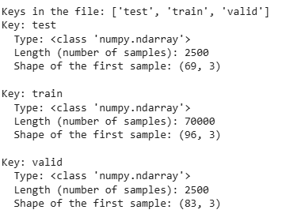
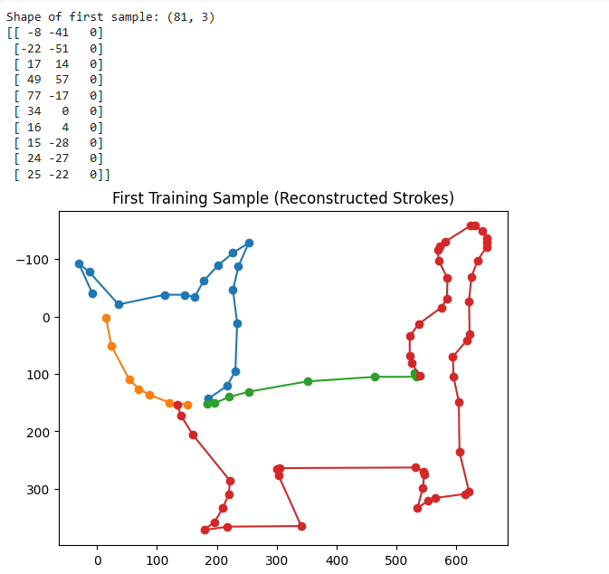

# Interactive AI Drawing Companion

## Project Overview

The aim of this project is to develop an interactive game where users draw objects in real time, and an AI system attempts to guess what has been drawn. This project combines computer vision, deep learning, and human-computer interaction to create an engaging and educational experience. In addition to recognizing a wide range of hand-drawn sketches, the system is also designed to handle cases where the drawing does not belong to any of the known categories—a challenge known as out-of-distribution (OOD) detection. Addressing these cases adds a valuable research component to the project.

## High-Level System Architecture

### 1. Data Preprocessing and Augmentation

- **Primary Data Source:**  
  The project leverages the [Quick, Draw! dataset](https://quickdraw.withgoogle.com/data) by Google, which contains over 50 million hand-drawn sketches across a variety of categories. The dataset is originally in vector form, and a preprocessing step is needed to convert these sketches into raster images compatible with convolutional neural networks (CNNs).

- **Preprocessing Techniques:**  
  - **Normalization:** Standardizing the input data.
  - **Resizing:** Ensuring all sketches are of uniform dimensions.
  - **Data Augmentation:** Applying transformations like rotations, translations, and scaling to increase the robustness of the model.

### 2. Neural Network Architecture

- **Core Recognition Engine:**  
  A deep convolutional neural network (CNN) will serve as the primary recognition engine. Due to the abstract and often variable nature of hand-drawn sketches, the architecture may also incorporate additional layers to capture sequential stroke information if the drawing sequence data is used.

- **Real-Time Performance:**  
  Given the interactive nature of the game, the neural network must be optimized for low-latency inference.
### 3. Out-of-Bound (OOD) Detection

Handling drawings that do not belong to any of the known categories is a central research aspect of this project. Several methods will be explored:

- **Confidence Thresholding:**  
  - After the network outputs class probabilities (typically through a softmax layer), a confidence threshold will be set.
  - If the maximum probability is below the threshold, the input will be flagged as “unknown.”
  

### 4. Interactive Feedback Mechanism

The system is designed to provide immediate and clear feedback to users:

- **Recognized Drawings:**  
  The system displays the predicted label along with a confidence score.

- **Unknown Drawings:**  
  If the drawing does not meet the criteria for any known category, the system can output an “unknown” label and prompt the user to refine their drawing or try another object.

This interactive feedback loop is crucial for maintaining user engagement and ensuring that the application is both challenging and enjoyable.

## Datasets and Data Requirements

### Primary Dataset

- **Quick, Draw! Dataset:**  
  This dataset is the backbone of the project, offering a diverse and extensive collection of sketches in hundreds of categories. Its variety is ideal for training a robust recognition model. However, due to the inherent variability in drawing styles, extensive preprocessing and data augmentation are required to ensure that the model can generalize effectively.

### Additional Data for Out-of-Bound Cases

To effectively address the challenge of OOD detection, additional data sources or methods may be needed:

- **Synthetic or Noise Images:**  
  - Generating random noise or abstract patterns that do not belong to any known category can serve as negative examples.
  
- **Alternative Sketch Datasets:**  
  - Other publicly available sketch datasets can provide examples of drawings that differ stylistically from those in the Quick, Draw! dataset.
  
- **User-Contributed Drawings:**  
  - In later phases, collecting sketches from actual users in a controlled environment can provide real-world examples of out-of-bound inputs.

## Key Features and Technical Considerations

### Feature Extraction

- **Visual Features:**  
  The model will extract key visual features such as edges, contours, and stroke sequences. These features are essential for recognizing the abstract representations typical of hand-drawn sketches.
- **Automated vs. Engineered Features:**  
  Depending on the architecture, these features might be learned automatically via convolutional layers or be explicitly engineered during preprocessing.

### Real-Time Inference

- **Performance Optimization:**  
The application demands real-time inference capabilities. To meet these requirements, techniques such as efficient model architectures and possible model quantization will be investigated.

### Evaluation Metrics

- **Standard Metrics:**  
  The classification performance will be evaluated using accuracy metrics.
- **OOD Metrics:**  
  Additional metrics such as the Area Under the Receiver Operating Characteristic (AUROC), precision, and recall for unknown detection will be crucial in assessing the effectiveness of the out-of-bound detection strategies.

  # Interactive AI Drawing Companion

## Part 2: Data Acquisition and Partitioning

### Overview

For this phase, we have acquired the **Sketch-RNN QuickDraw Dataset**, a subset of the Google Quick, Draw! dataset, to serve as our training and validation data. The dataset contains simplified vector sketches in `.npz` files, each corresponding to a specific category (e.g., `cat.npz`, `dog.npz`). Each file typically includes three arrays: `train`, `valid`, and `test`, providing a pre-made split for training, validation, and testing known categories. We will also collect or generate an **"unknown"** subset later in the semester to evaluate our model's ability to detect out-of-distribution inputs.

---

### 1. Data Source

- **Dataset Name:** [QuickDraw Dataset](https://quickdraw.withgoogle.com/data)  
- **Associated References/Papers:**
  - *Ha, D., Eck, D. (2017). A Neural Representation of Sketch Drawings.*  
    Available via the Google Research Blog and [Magenta Project](https://github.com/magenta/magenta).
  - Official Quick, Draw! documentation on [Data](https://quickdraw.withgoogle.com/data) and the Sketch-RNN model.
  - [ Open World Object Detection](https://openaccess.thecvf.com/content/CVPR2021/papers/Joseph_Towards_Open_World_Object_Detection_CVPR_2021_paper.pdf)

---

### 2. Differences Between the Training and Validation Subsets

1. **Purpose of Each Subset**  
   - **Training (train):** Used to optimize the model’s learnable parameters (weights, biases). The dataset includes tens of thousands of sketches per category to ensure robust coverage of drawing variations.
   - **Validation (valid):** Helps monitor overfitting and guides hyperparameter tuning. Although drawn from the same categories as the training set, it is kept separate so that performance metrics are not biased by overexposure to training data.

2. **Data Distribution**  
   - Both `train` and `valid` subsets share the same label categories (e.g., “cat”, “bicycle”), but the validation set is typically much smaller (around 2,500 samples per category) compared to the training set (around 70,000). This distribution ensures the validation set remains a representative, yet sufficiently distinct, sample for evaluating generalization.

3. **Hyperparameter Tuning and Early Stopping**  
   - We use the validation subset to adjust learning rates, network architectures, and regularization parameters. When validation performance stops improving or begins to degrade, we can apply early stopping to avoid overfitting.

---

### 3. Number of Distinct Objects and Samples

- **Categories:** Approximately 345 different classes (e.g., “cat,” “dog,” “apple,” “airplane”).  
- **Samples per Category:**  
  - **Training:** ~70,000 sketches  
  - **Validation:** ~2,500 sketches  
  - **Test (Known Categories):** ~2,500 sketches  

Because we are focusing on a subset of these categories initially, we may only download specific `.npz` files (e.g., `cat.npz`, `dog.npz`) to keep our project scope manageable. The full dataset, however, offers extensive variety for future experimentation.

---

### 4. Characterization of Samples

1. **Format and Resolution**  
   - **Vector Data:** Each `.npz` file stores sketches in a sequence of `[dx, dy, pen_state]`, representing stroke offsets and pen-lift events.  
   - **Simplification Process:**  
     1. Aligned to the top-left corner (min x, y = 0).  
     2. Uniformly scaled so the maximum coordinate is 255 (fitting a 256×256 region).  
     3. Resampled at ~1 pixel spacing.  
     4. Ramer–Douglas–Peucker (RDP) algorithm applied (epsilon=2.0) to remove redundant points.

2. **Sensors and Ambient Conditions**  
   - Data comes from a web-based game; there is no significant variation in lighting or sensor type since all drawings are captured digitally.

3. **Stroke vs. Image Representation**  
   - While the dataset is stored as vector strokes, we can convert them to raster images (e.g., 28×28 or 64×64) if a convolutional neural network is preferred.

4. **Example Usage**  
   - **RNN/LSTM** approaches can process stroke-by-stroke input.  
   - **CNN** approaches require rendering or rasterizing the vector data into images.

---

### 5. "Unknown" Subset for Final Evaluation

In addition to the known categories, we will prepare an “unknown” partition that is kept untouched until final evaluation. This subset will include:

- **Sketches from Unused Categories:** If we choose only a subset of the 345 classes for training, any classes we omit can serve as “unknown” categories.  
- **External or Synthetic Data:** We may incorporate sketches from other sources (e.g. or random noise patterns, or create our own samples as vectors) to represent out-of-distribution samples.

The purpose is to test the model’s out-of-bound detection—verifying whether it can correctly identify inputs that do not match any known category.

---

### 6. Sample Exploration

## Conclusion

This project seeks to blend advanced neural network techniques with interactive design principles to create a unique and engaging drawing game. By leveraging the extensive Quick, Draw! dataset and incorporating advanced out-of-bound detection methods—such as confidence thresholding, uncertainty estimation, the system is designed to handle both typical and novel inputs robustly. As the project evolves, additional refinements and potential multimodal integrations may be considered to further enhance both the technical performance and the overall user experience.

